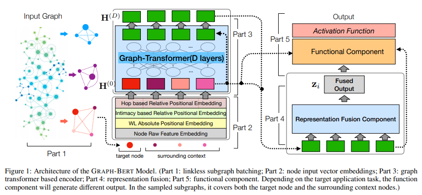

## GRAPH-BERT: Only Attention is Needed for Learning Graph Representations
SUMMARY:

- 提出了一个模型:
  - batch选择：基于PageRank的相似度
  - 特征嵌入：原始特征信息、全局结构信息、局部位置信息、局部结构信息
  - Transformer Embedding
  - 特征融合：只用中心结点的特征
- 克服了三个问题：
  - 深了不再更新；
  - 深了特征过于平滑；
  - 原始GNN结点多的话内存占用太大
- 提出了三个使用方法
  - 直接接下游任务；
  - 预训练：结点特征恢复、图结构恢复；
  - 精调：结点分类、图聚类；
  
  
  ANNOTATED PAPER: [PDF](GraphBERT.pdf)
